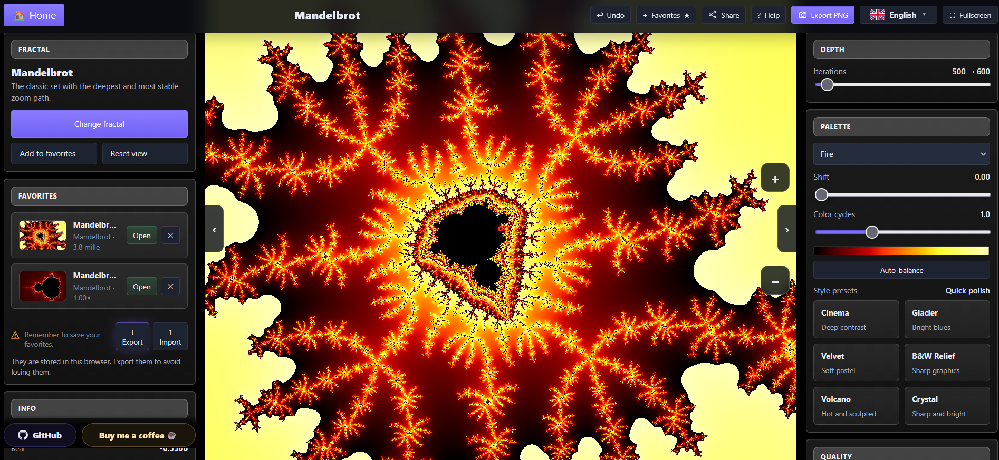
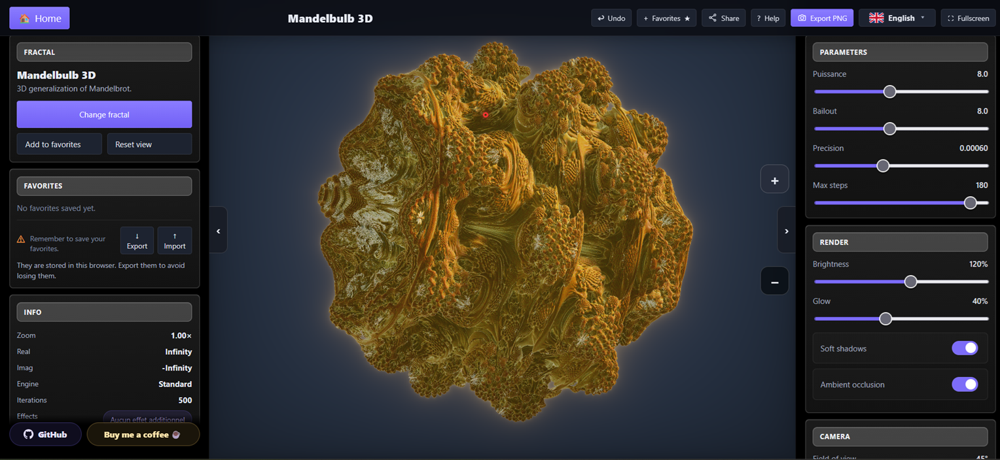

  

<h1 align="center">Fractal Explorer</h1>

  Un explorateur de fractales gratuit, standalone, qui tourne directement dans le navigateur — sans installation.
   
  <em>On peut maintenant mettre des mondes entiers sur une disquette...</em>

  <a href="https://fabzh.eu/fractales.html"><strong>Essayer en ligne</strong></a>
  &nbsp;·&nbsp;
  <a href="https://github.com/Fabrice-breizh/Fractales-Explorer/raw/main/fractales.html">Télécharger</a>
  &nbsp;·&nbsp;
  <a href="README.md">🇬🇧 Read in English</a>

  
  
  
  
  

---

## Captures d'écran

| Mandelbrot | Mandelbulb 3D |
|:---:|:---:|
|  |  |

---

## Fonctionnalités

### 36 fractales 2D interactives
Mandelbrot, ensembles de Julia, Burning Ship, Newton, Tricorn, Lyapunov, Sierpinski, et bien d'autres.

### 4 fractales 3D en temps réel
Mandelbulb, Mandelbox, Éponge de Menger, Julia Quaternion — rendues en WebGL2.

### Contrôles visuels
- Palettes de couleurs et effets de cycle
- Zoom, déplacement, double-clic pour explorer
- Raccourcis clavier pour une navigation rapide

### Export et sauvegarde
- Export PNG en haute résolution
- Sauvegarde et restauration de vues favorites en local
- Import / export des favoris

### Interface multilingue
🇸🇦 Arabe · 🇨🇳 Chinois · 🇬🇧 Anglais · 🇫🇷 Français · 🇮🇳 Hindi · 🇪🇸 Espagnol
*(d'autres langues à venir)*

### Vraiment standalone
Tout est contenu dans **un seul fichier HTML** — fonctionne hors ligne, sans serveur, sans dépendances.

---

## Navigation

**À la souris**

| Action | Effet |
|--------|-------|
| `Glisser` | Déplacer la vue |
| `Molette` | Zoomer vers le curseur |
| `Shift` + `Glisser` | Sélectionner une zone à zoomer |
| `Double-clic` | Zoom ×2 sur le point sélectionné |

**Au clavier**

| Touche | Action |
|--------|--------|
| `+` / `-` | Zoomer / dézoomer |
| `←` `→` `↑` `↓` | Déplacer la vue |
| `Home` | Réinitialiser la vue |
| `Tab` | Ouvrir ou fermer le panneau |
| `H` | Ouvrir l'aide |
| `G` | Ouvrir la galerie |
| `T` | Lancer la visite guidée Mandelbrot |
| `Esc` | Fermer les fenêtres / retour accueil en 3D |

---

## Pour commencer

1. **Télécharger** [`fractales.html`](https://github.com/Fabrice-breizh/Fractales-Explorer/raw/main/fractales.html)
2. **Ouvrir** dans n'importe quel navigateur moderne (Chrome, Firefox, Edge, Safari)
3. **Explorer** — c'est tout

Ou simplement [essayer en ligne](https://fabzh.eu/fractales.html) sans rien télécharger.

> **Prérequis :** Un navigateur avec support WebGL2 (tous les navigateurs modernes).

---

## Pourquoi ce projet existe

J'ai découvert les fractales dans les années 1990.

À l'époque, il y avait quelque chose de presque magique dans ces images : des formes mathématiques, calculées par des machines relativement modestes, qui semblaient pourtant contenir des mondes entiers. Mandelbrot, Julia, les palettes cycliques, les zooms lents, les rendus qui demandaient de la patience… tout cela avait un charme très particulier.

Des outils comme Fractint, XaoS, Ultra Fractal, et Electric Sheep ont contribué à définir cette époque et sa culture visuelle. Ce projet est né de ce souvenir : l'envie de retrouver ce sentiment d'exploration, mais dans un navigateur moderne, sans installation compliquée, et avec une interface plus immédiate.

## Vibe coded, human designed

Ce projet est **vibe coded** : une partie significative du code a été écrite avec l'aide d'outils IA.

Mais il n'est **pas conçu par une IA**.

La direction, l'ergonomie, le rythme, le style visuel, le contenu, les priorités et l'expérience utilisateur sont des choix humains.

---

## Soutenir le projet

Fractal Explorer est gratuit et open source.

Si tu l'apprécies, tu peux aider à le faire vivre :

☕ [M'offrir un café](https://buymeacoffee.com/fabricebreizh)

---

## Licence

[MIT](LICENSE) © Fabrice-breizh
